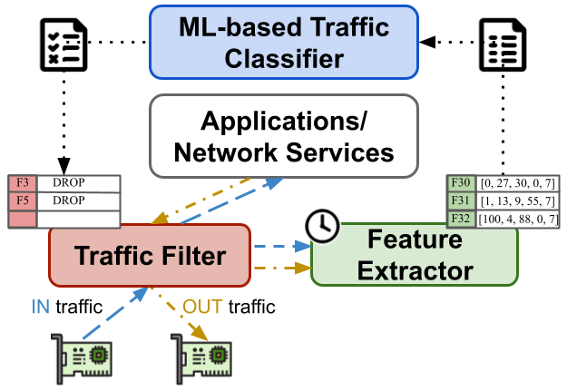

<!-- markdown-link-check-disable -->

<!-- markdown-link-check-enable -->

# Enhancing Network Intrusion Detection: An Online Methodology for Performance Analysis

***ENID*** is a complete toolkit developed to support our research. The aim is to enhance the traditional evaluation of ML-based ***Network Intrusion Detection Systems (NIDS)*** by proposing an additional testing phase that, instead of using the test portion of the dataset, leverages network traffic captures to simulate a real attack situation. Differently than the typical test-set assessment that we define as ***offline testing***, an ***online testing*** phase evaluates all the Monitoring-Detection-Mitigation pipeline of the NIDS, rather than just its detection model.

The simulation phase should provide more insights concerning how the setup of the NIDS handles and respond to ongoing threats, not only from the detection point of view, but also concerning resource consumption, the management of both legitimate and malicious network traffic, and more. We believe that traditional ML testing metrics (e.g., accuracy) may not be enough and fully explicative. As in our previous work [1] we highlighted the advances of having different monitoring configurations, in this research we want to observe how such a different amount and granularity of extracted information affects the entire detection and mitigation process of a NIDS.

***Paper Abstract***:

*Machine learning models have been extensively proposed for classifying network flows as benign or malicious, either in-network or at the endpoints of the infrastructure. Typically, the performance of such models is assessed by evaluating the trained model against a portion of the available dataset. However, in a production scenario, these models are fed by a monitoring stage that collects information from flows and provides inputs to a filtering stage that eventually blocks malicious traffic. To the best of our knowledge, no work has analysed the entire pipeline, focusing on its performance in terms of both inputs (i.e., the information collected from each flow) and outputs (i.e., the system’s ability to prevent an attack from reaching the application layer).*

*In this paper, we propose a methodology for evaluating the effectiveness of a Network Intrusion Detection System (NIDS) by placing the model evaluation test alongside an online test that simulates the entire  onitoring-detection-mitigation pipeline. We assess the system’s outputs based on different input configurations, using state-of-the-art detection models and datasets. Our results highlight the importance of inputs for the throughput of the NIDS, which can decrease by more than 50% with heavier configurations. Furthermore, our research indicates that relying solely on the performance of the detection model may not be enough to evaluate the effectiveness of the entire NIDS process. Indeed, even when achieving near-optimal False Negative Rate (FNR) values (e.g., 0.01), a substantial amount of malicious traffic (e.g., 70%) may still successfully reach its target.*

## Installation

Whether using a virtual environment or not (e.g., using Venv or Conda), to install the list of requirements type:

```bash
❯ python3 -m pip install -r requirements.txt
```

## Replicability

To obtain the same result among different runs, users can set the environment variable `PYTHONHASHSEED=X` where X is a given number (e.g., 1). This ensures deterministic random states and executions.

## Usage

While the [enid/lib](./enid/lib) directory defines the core library of the framework, all the Python files in the parent [enid](./enid) folder are the main programs exposed by the framework. In particular, here follows a brief tutorial that introduces all of them step-by-step.

### Step 1 - Network Traffic Capture organization

To start with, network traffic captures are required. You can either use your own or use public and open-access ones, such as the [Canadia Institute for Cybersecurity](https://www.unb.ca/cic/datasets/index.html). In our publication, we used the [Intrusion Detection Evaluation Dataset (CIC-IDS2017)](https://www.unb.ca/cic/datasets/ids-2017.html).

Organize a `capture` folder accordingly, in order to have a structure as follows:

```bash
❯ ls captures
captures
├── IDS2017
│   ├── benign.pcap
│   ├── ddos.pcap
├── IDS2012
...
```

When it comes to training and testing the detection engine, the system will make use of 3 traffic captures for each category. For instance, for the dataset `IDS2017`, instead of a single `benign.pcap` file the system requires three `benign[i].pcap` files, one used for training, one for validation, and one for testing. 

This result can be achieved by manually organizing the capture folder for each dataset to have subfolders containing at least 3 captures for each category, such as:

```bash
❯ ls captures
captures
├── IDS2017
│   │── benign
│   │   ├── benign1.pcap
│   │   ├── benign2.pcap
│   │   └── benign3.pcap
│   └── ddos
│       ├── ddos1.pcap
│       ├── ddos2.pcap
│       └── ddos3.pcap
├── IDS2012
...
```

Otherwise, follow [Step 3](#step-3---splitter) of this guide to automatically split the provided captures.

### Step 2 - [Register](./enid/register.py) [Optional]

If you plan to define your own Detection Engine, please go to the [Write your Own Detection Model](#write-your-own-detection-model) section for accordingly defining a usable and supported engine. Otherwise, the framework already includes 3 different engines under the [**engines**](./enid/lib/engines/) folder that we used for the comparison in the paper:

1. [**LucidCnn**](./enid/lib/engines/lucid_cnn/): implementation of *Lucid*[2] using the Convolutional Neural Network defined in our previous work.
1. [**LucidMlp**](./enid/lib/engines/lucid_mlp.py): implementation of Lucid using a Multi-Layer Perceptron network (Fully-Connected Dense).
1. [**LucidRnn**](./enid/lib/engines/lucid_rnn.py): implementation of Lucid using a Recurrent Neural Network (LSTM).

To register your custom engine (whether defined in a folder *X* or in a file *X.py*):

```bash
❯ python3 -m enid register X # or X.py
```

If the engine is compliant and usable, no error arises. Otherwise, the registration is interrupted.

### Step 3 - [Splitter](./enid/splitter.py)

If you don't have enough captures for each category as previously mentioned in [Step 1](#step-1---network-traffic-capture-organization), you can use this tool to achieve that. It'll split all the captures contained in the provided folder into chunks of specified sizes, which will be put inside a subdirectory named accordingly. 

Example: given the directory and running the following command will output:

```bash
❯ ls captures
captures
├── IDS2017
│   ├── benign.pcap
│   ├── ddos.pcap
├── IDS2012
...
❯ python3 -m enid_simulator splitter captures/IDS2017/
❯ ls captures
captures
├── IDS2017
│   │── benign
│   │   ├── benign1.pcap
│   │   ├── benign2.pcap
│   │   └── benign3.pcap
│   └── ddos
│       ├── ddos1.pcap
│       ├── ddos2.pcap
│       └── ddos3.pcap
├── IDS2012
...
```

### Step 4 - [Preprocesser](./enid/preprocesser.py)

Now that the capture folder is organized as expected, you can start preprocessing your datasets. To do that, use this script specifying:

1. a list of captures directories (e.g., 'captures/IDS2017 captures/IDS2018')
1. a time interval in **nanoseconds** used to separate traffic and pass the gathered data to the detection engine
1. the name of the detection engine to use for processing the traffic
1. additional parameters related to the traffic analysis methodology specified by the engine (e.g., maximum packets for each flow).

Example:

```bash
❯ python3 -m enid preprocesser 10000000000 TwoIPsProtoPortsKey LucidCnn 10 captures/IDS2017 captures/IDS2012
```

This command will preprocess captures of datasets IDS2017 and IDS2012 using the TrafficAnalyser and Preprocessing methods specified in *LucidCnn*, grouping flows using the *TwoIPsProtoPortsKey* (i.e., source and destination IP addresses, L4 ports, and L4 protocol), a time window of 10 seconds (10000000000 nanoseconds), taking a maximum of 10 packets per flow (additional argument required by LucidCnn). It'll output preprocessed files (using the *.h5* format) in the `preprocessed` directory, grouping files by dataset, such as:

```bash
❯ ls preprocessed
├── LucidCnn
    ├── 10p-10f-10000000000t-IDS2017
    │   │── conf.json
    │   │── benign
    │   │   ├── benign1.h5
    │   │   ├── benign2.h5
    │   │   └── benign3.h5
    │   └── ddos
    │       ├── ddos1.h5
    │       ├── ddos2.h5
    │       └── ddos3.h5
    ├── 10p-10f-10000000000t-IDS2012
...
```

The `conf.json` files include important information later used by the other scripts, such as:

1. parameters used for the generation of the file
1. number of benign/malicious flows for each capture and dataset
1. number of unique benign/malicious flows for each capture and dataset
1. ...

### Step 5 - [Datasetter](./enid/datasetter.py)

At this point, with all the preprocessed captures, you can easily create a dataset, optionally mixing captures from different datasets, so far kept separate. The only requirements for mixing such files are:

1. they must have been created by using the same or compatible DetectionEngine;
2. they must have been created by using the same parameters (e.g., same time window).

An additional parameter to pass to this program is the percentage of the training set used for the validation and test sets. The network captures for the online test correspond to the ones used for the test set, but without balancing the samples, differently than for the training/validation/test sets. The resulting network capture is named `combined.pcap` and it contains all packets sorted by arrival time, while a `combined.joblib` containing the list of origin of each packet (i.e., dataset, category, and capture) is generated for the later test.

Example:

```bash
❯ python3 -m enid datasetter preprocessed/LucidCnn/10p-10f-10000000000t-IDS2017
❯ ls datasets
datasets
├── IDS2017-LucidCnn
    ├── train.h5
    ├── validation.h5
    ├── test.h5
    ├── combined.pcap
    ├── combined.joblib
    ├── conf.json
```

### Step 6 - [Trainer](./enid/trainer.py)

The creation of models is strictly related to the DetectionEngine of interests: each typology has its own set of parameters that can be either provided as a single value or as a list of possible values to try. To iteratively decrease the set of input information required for training and using the models (i.e., from using *F* features to *F-1*), the program leverages the pruning algorithm specified in the Engine definitions, which should remove, after ranking all the features, the least relevant one.

During this phase, models are also tested using the `test.h5` file according to the traditional ML validation phase. A set of metrics is recorded and stored using different granularities (i.e., general score, per dataset, category, and capture scores).

To plot the results of the training plus additional information concerning the detection models, please refer to the [Plot Section](#7---plot-results). 

Example:

```bash
❯ python3 -m enid trainer IDS2017-LucidCnn MyModelOutputDir LucidCnn --packets_per_session 10 8 5 3 2 1 --learning_rate 0.001 --batch_size 512 --kernels 64 --regularization l2 --dropout 0.2
❯ ls datasets/IDS2017-LucidCnn/MyModelOutputDir
MyModelOutputDir
├── models
    ├── 10p-10f
        ├── results.json
        ├── params.json
        ├── history.json
        ├── weights.h5
    ...
    ├── 1p-1f
        ├── results.json
        ├── params.json
        ├── history.json
        ├── weights.h5
```
In this case, a specific set of parameters is given (i.e., learning rate, regularization, kernels, batch size, dropout), hence the program does not need to perform a grid search to look for the best ones.

### Step 7 - [Tester](./enid/tester.py)

The online testing of the generated models within the NIDS is performed in parallel leveraging all available CPU cores. Each model generated is tested against the capture generated while creating the dataset, and the entire infrastructure is built, following this pipeline:



There are two main flows divided into colours:

1. **Yellow and Blue**: every packet in the network capture passes through the *Traffic Filter* and the *Feature Extractor* before theoretically entering or leaving the system. If the filter matches the session identifier of the packet, then it is discarded without further ado. Otherwise, it is forwarded to the extractor module, which extracts the actual set of information from it according to its current analysis state and parameters (i.e., number of features, etc.);
1. **Black**: upon the end of every time window, the current unlabelled data gathered by the extractor is forwarded to the ML-based classifier. The classifier outputs a value from 0 (benign) to 1 (malicious) that is approximated according to a provided threshold (i.e., 0.5). All the flows classified as malicious are inserted into a waiting queue that, according to the provided policy enforcement delay, contains all the sessions to be mitigated. All the items in the queue that expire are inserted into the traffic filter as a mitigation rule

This program requires a maximum number of monitored sessions per time window (default all), and the enforcement delay (default 0, mitigate instantly). Results are reported in Json files and can be plotted by following [Step 8](#step-8---plotter).

Example:

```bash
❯ python3 -m enid tester datasets/IDS2017-LucidCnn/MyModelOutputDir
❯ ls datasets/IDS2017-LucidCnn/MyModelOutputDir/normal_test
normal_test
├── 10p-10f
    ├── results.json
...
├── 1p-1f
    ├── results.json
```

### Step 8 - [Plotter](./enid/plotter.py)

Once finished training and testing your models, you can visualize results leveraging this utility. Given the path to the current set of models you want to analyze, this script can plot:

1. the features' relevances for each model, using a horizontal bar chart;
1. the history of each model, showing the loss and accuracy of both train and validation sets;
1. the computational requirements of each model, in terms of trainable parameters;
1. the aggregate result of the offline test of the models during the training phase;
1. the per capture, category and dataset results of the models during the offline testing phase;
1. the aggregate result of the models during the online testing phase
1. the per capture, category and dataset results of the models during the online testing phase;

The offline and online test results of the models can be plotted as a boxplot by aggregating values by features or any other additional parameters that are being used for the definition of the model (e.g., the maximum number of packets of each flow in Lucid).

Example:

```bash
❯ python3 -m enid plotter datasets/IDS2017-LucidCnn/MyModelOutputDir -mf -fr -th -tr -trd -ts -tsd -b
```

### Step 7 - [Comparator](./enid/comparator.py) [Optional]

In case [Step 7](#step-7---tester) has been executed using the enhanced debug mode, this file compares the Json output of the provided models to look for diversities in terms of blocked malicious/benign sessions. Additionally, you can specify a threshold that represents the n° of packets erroneously blocked/not-blocked that must be at least considered for printing the results, in case tons of flows are recorded.

## Write your Detection Model

Users can write their own detection model with their preprocessing, training, and feature ranking rules. Engines must be put inside the [*engines*](./enid/lib/engines/) directory according to [Step 2](#step-2---register-optional). The program places the desired engine in the right folder of the ENID module, according to your local installation.


To create a new one, create a file (or a directory, better for readability) with inside a class definition named as the filename in camel case (e.g., the file *lorem_ipsum.py* needs to contain a class *LoremIpsum*) that implements all the abstract methods included in the **DetectionEngine** class definition. Within this definition, a detection engine must be linked to a specific traffic analyser and a specific class to hold all the needed features that are accordingly defined within the engine itself.

For an example of how to write a Detection Model, please look at the [LucidCnn](./enid/lib/engines/lucid_cnn/) engine which contains full definitions of traffic analyser, features and methods.

## References

[1] *S. Magnani, F. Risso and D. Siracusa, "A Control Plane Enabling Automated and Fully Adaptive Network Traffic Monitoring With eBPF," in IEEE Access, vol. 10, pp. 90778-90791, 2022, doi: 10.1109/ACCESS.2022.3202644.* ([Repository](https://github.com/s41m0n/opportunistic_monitoring), [Paper](https://ieeexplore.ieee.org/document/9869628/))

[2] *R. Doriguzzi-Corin, S. Millar, S. Scott-Hayward, J. Martínez-del-Rincón and D. Siracusa, "Lucid: A Practical, Lightweight Deep Learning Solution for DDoS Attack Detection," in IEEE Transactions on Network and Service Management, vol. 17, no. 2, pp. 876-889, June 2020, doi: 10.1109/TNSM.2020.2971776.* ([Repository](https://github.com/doriguzzi/lucid-ddos), [Paper](https://ieeexplore.ieee.org/document/8984222))

## Acknowledgements

If you are using ENID's code for scientific research, whether to replicate experiments or try new ones, please cite the related paper in your manuscript as follows:

TO BE INSERTED (ongoing publication)

This work was partially supported by project SERICS (PE00000014) under the MUR National Recovery and Resilience Plan funded by the European Union- NextGenerationEU and by European Union’s Horizon Europe Programme under grant agreement No 101070473 (project FLUIDOS).

Finally, I sincerely thank my PhD advisors Dr. Domenico Siracusa and Dr. Roberto Doriguzzi-Corìn for their vital contribution to the realisation of this research.

## License

The code is released under the Apache License, Version 2.0.
